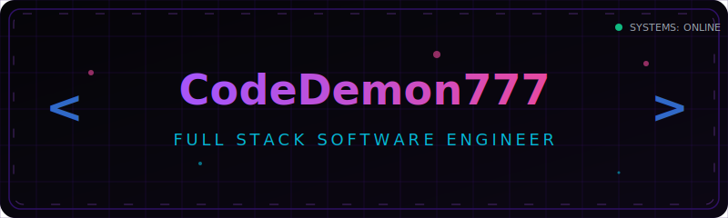

  

  

---

### 🔮 About Me

I am a full stack software engineer dedicated to building clean, secure, and highly optimized web interfaces. I specialize in merging technical engineering with design principles, resulting in web solutions that perform exceptionally under the hood and look breathtaking on the outside.

- ⚡ **Focusing on**: React/Next.js, Node.js, Python, Rust, and Cloud Orchestration.
- 🛠️ **Design Philosophy**: Interaction is key. I design fluid animations and interactive particle interfaces.
- 🚀 **Personal Website**: Check out my [Animated Portfolio](https://profolio-gamma-puce.vercel.app/)! (Built using modern responsive architectures).

---

### 🛠️ Tech Stack

  

---

### 📊 GitHub Activity & Metrics

<table align="center" border="0" cellpadding="0" cellspacing="0">
  <tr>
    <td valign="top" width="50%">
      
    </td>
    <td valign="top" width="50%">
      
    </td>
  </tr>
</table>

---

### 🐍 Contribution Grid Snake

  

---

### 🤝 Connect with Me

  
  
  

